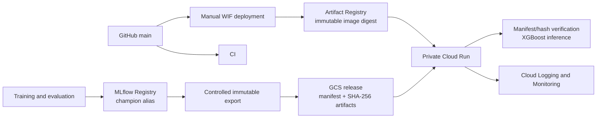

# Fraud Risk Engine

A private FastAPI service for repeatable fraud-risk scoring with a verified,
immutable XGBoost release. Training, evaluation, governance, release export,
serving, deployment, and monitoring are deliberately separate concerns.

## 1. Problem

Fraud detection is both imbalanced and time-sensitive. Fraud is rare enough
that accuracy can hide a weak detector, while transaction behavior and attack
patterns change over time. Random splits can leak later behavior into training
and overstate production performance.

This project therefore uses a chronological split, reports precision, recall,
F1, ROC-AUC, and PR-AUC, and stores the operating threshold with the model.
The threshold makes review volume and missed-fraud risk an explicit operating
decision rather than an implicit library default.

## 2. Dataset and temporal split

The sanitized training notebook contains 1,000,000 rows. Records are split by
month so every evaluation period follows its training period.

| Split | Months | Rows | Fraud rate |
|---|---:|---:|---:|
| Train | 0–5 | 794,989 | 1.0253% |
| Validation | 6 | 108,168 | 1.3405% |
| Test | 7 | 96,843 | 1.4746% |

The increasing fraud rate is one reason to preserve time order and monitor the
serving system after release. The test split is held out for final comparison;
it is not used to fit the models.

## 3. Model comparison and threshold decision

Held-out results recorded in the sanitized notebook are:

| Model | Threshold | Precision | Recall | F1 | ROC-AUC | PR-AUC |
|---|---:|---:|---:|---:|---:|---:|
| Logistic Regression | 0.91 | 0.2744 | 0.1933 | 0.2268 | 0.8815 | 0.1791 |
| XGBoost | 0.90 | 0.2649 | 0.2276 | 0.2448 | 0.8918 | 0.1902 |
| PyTorch MLP | 0.93 | 0.2382 | 0.2941 | 0.2632 | 0.8877 | 0.1885 |

XGBoost was selected because it has the strongest ROC-AUC and PR-AUC and a
simpler native production serialization path. The `0.90` threshold makes the
alert-volume versus precision/recall tradeoff explicit. Changing it requires a
new governed model release; the API does not accept a threshold override.

## 4. Final model and immutable release contract

The approved model contract is fixed:

| Field | Value |
|---|---|
| Model | XGBoost |
| Registered model version | `2` |
| MLflow model ID | `m-3e65f5fd985a4b6f929abc2057fc7a89` |
| Decision threshold | `0.90` |
| Release | `v2-3e65f5fd-88b81f0` |
| Production URI | `gs://fraud-risk-engine-models/releases/v2-3e65f5fd-88b81f0/` |
| Model-source Git commit | `88b81f0017c8d90457e16ffeeebb02dbe1642e1b` |

Each release directory contains one manifest and exactly two approved model
artifacts. The manifest records model/run identity, feature order, threshold,
source commit, creation time, and a SHA-256 for each artifact. Export refuses
to overwrite an existing release.

At startup the service downloads only those three release objects, validates
the manifest schema and exact feature contract, checks both artifact hashes,
and only then loads the preprocessor and model. A failed verification leaves
`/ready` unavailable and prevents prediction.

Model provenance and serving-code provenance are intentionally distinct. The
manifest keeps the model export commit. A deployment image is tagged from the
serving Git commit plus release name, labelled with both identities, pushed
once, resolved to an immutable Artifact Registry digest, and deployed by that
digest.

Live-state note (verified 2026-09-24): production serves private Cloud Run
revision `fraud-risk-api-00006-zaq` at 100% ordinary traffic. Its deployed image
index digest is
`sha256:1ed0f5613452ddd3c83a396f5c2d4b3f3f1817a0882a1e2e4a72c5d85eae133c`;
Cloud Run imported linux/amd64 manifest digest
`sha256:f83c3f2f74e62a846ade5381b8049cc19b0c02e72444493700d70f4e3a9e3dcc`.
That revision serves the approved release above. See `PRODUCTION_READINESS.md`
for the distinction between current live evidence and the pending audit rollout.

## 5. Production architecture



MLflow is not in the request path. Cloud Run reads an immutable GCS release;
it does not contact the registry, a tracking server, or training storage.

## 6. API endpoints and production settings

The service exposes three JSON endpoints:

| Endpoint | Purpose | Success response |
|---|---|---|
| `GET /health` | Process liveness | `200 {"status":"ok"}` |
| `GET /ready` | Verified model readiness | `200 {"status":"ready"}` |
| `POST /predict` | Fraud probability, classification, and release threshold | `200` response schema |

`/ready` returns `503` until the release has loaded. `/predict` returns `503`
when the model is unavailable. Cloud Run IAM rejects an unauthenticated
request before the application handles it.

The production deployment settings encoded in the manual workflow are:

| Setting | Value |
|---|---|
| Service / region / project | `fraud-risk-api` / `europe-west1` / `fraud-risk-engine` |
| Access | Private Cloud Run service |
| CPU / memory | `1 CPU` / `1Gi` |
| Concurrency | `4` |
| Minimum / maximum instances | `0` / `3` |
| Request timeout | `60s` |
| Startup CPU boost | Enabled |
| Model location | Exact immutable GCS URI |
| Runtime storage access | Bucket-only object read |

## 7. MLflow governance role

Training and registration are local-only. MLflow records experiments, model
versions, metrics, run identity, and the `champion` alias. A controlled export
resolves that alias once to an immutable version and creates the release
manifest and hashed artifacts. The runtime package has no MLflow dependency;
ordinary tests, Docker runtime, and Cloud Run inference remain independent.

Real integration and export require an approved pre-existing local registry database and artifact
store containing `fraud-risk-model@champion`; for this release, that alias must resolve model
version `2`. Those governed files are intentionally local and not distributed in Git. A clean
checkout can run fast/default tests and build Docker, but cannot run real integration or export
until the approved local state is restored.

The approved immutable production release is reused for deployments and must
not be re-exported, overwritten, or regenerated merely for deployment.

## 8. CI, integration, and manual deployment workflows

The CI workflow runs on pushes and pull requests. It installs Python 3.14
dependencies, runs Ruff, mypy, the service-independent test suite, and a Docker
build. MLflow integration tests are intentionally local because their registry
and artifacts are local-only.

`.github/workflows/deploy.yml` is a separate `workflow_dispatch` workflow for
`main`. WIF, the scoped deployer account, and both GitHub variables are live.
Deployment run `32854613397` completed the first automated rollout from
`a1615f6` on 2026-08-25; the current audit revision is documented separately
until its own rollout completes.

For an authorized dispatch, the workflow:

1. validates `main`, the full Git SHA, and immutable release/version inputs;
2. runs the default tests and authenticates through GitHub OIDC and GCP WIF;
3. verifies that the service is private and records its prior Ready revision;
4. rejects a reused image tag, builds `linux/amd64`, pushes once, and
   cross-checks the tag against the registry digest;
5. deploys that digest as a tagged, zero-traffic candidate with the exact GCS
   URI and production settings;
6. confirms the prior revision still receives 100% ordinary traffic;
7. mints a canonical-audience identity token and smokes the candidate;
8. promotes only within the reserved time budget, then re-describes traffic to
   reconcile the outcome rather than trusting the command exit alone;
9. smokes the canonical route, removes the temporary tag, rechecks private
   IAM, and writes a non-sensitive summary.

The smoke client requires unauthenticated `/health` to return `403`, then
requires authenticated health and readiness responses. It submits two fixed
known-sample requests, checks both classifications, threshold `0.9`, and
probability tolerances (`1e-7` and `1e-6`). Its output contains endpoint status,
probabilities, and absolute differences only—never the identity token or input
features.

Operations that can stall are bounded. Before promotion, a cutoff reserves the
rest of the 60-minute job for recovery. An ordinary post-promotion failure
attempts one rollback to the recorded prior revision and verifies traffic.
Cancellation cleanup is best effort. Hard runner/job termination cannot execute
rollback; an operator must inspect traffic and use the manual procedure below.

## 9. Security and IAM

Cloud Run is private: no public principal is granted access. The service uses
the dedicated runtime identity
`fraud-risk-api-runtime@fraud-risk-engine.iam.gserviceaccount.com`, whose model
permission is only `roles/storage.objectViewer` on the model bucket. It has no
project-wide storage role and needs no MLflow or training-data access.

The least-privilege deployer uses no service-account JSON key and no GitHub
secret. GitHub OIDC trust is restricted to numeric repository/owner IDs,
`main`, and the exact deployment workflow. The deployer has only:

- `roles/iam.workloadIdentityUser` on its service account for that WIF principal;
- `roles/artifactregistry.writer` on the one image repository;
- `roles/run.developer` on the one Cloud Run service; and
- `roles/iam.serviceAccountUser` on the runtime service account.

Those bindings and WIF resources are verified live; there is no project-level
deployer role. Both deployer and runtime identities have zero user-managed
keys. Generated short-lived `gha-creds-*.json` files are ignored by Git and
excluded from the Docker build context.

## 10. Observability and alert behavior

Application logging is implemented with a JSON allowlist. Every record has
`severity` and `message`; event records can add only:

```text
event
model_version
model_release
source_git_commit
model_load_duration_ms
latency_ms
is_fraud
exception_type
error_message
```

The events are `model_startup`, `model_startup_failed`,
`prediction_completed`, and `prediction_failed`. Startup success identifies
the verified release and load duration. Prediction success records model
version, latency, and classification. Errors record the exception type and a
fixed safe message.

Request payloads, feature names/values, fraud probabilities, tokens,
credentials, and unknown fields are not serialized. Exception text is also
excluded because a library message could contain input-derived content. The
implementation is deployed, but fresh application-event evidence had aged out
of the available retention window at the 2026-09-24 audit; live observability
therefore remains partial until the audit rollout produces new events.

Cloud Run supplies request count, latency, instance count, CPU, and memory
metrics. The tracked policy defines a `5xx / total requests > 5%` condition for
five minutes in `europe-west1`, treats missing data as inactive, and closes an
incident automatically after 30 minutes.

`monitoring/cloud-run-5xx-rate-policy.json` is validated and deployed as policy
`projects/fraud-risk-engine/alertPolicies/17997922764504296330`. Enabled email
channel `projects/fraud-risk-engine/notificationChannels/7232674366703482783`
is attached to the policy.

## 11. Local setup, tests, Docker, release, deployment, and rollback

Python 3.14 is required:

```bash
python3.14 -m venv .venv
source .venv/bin/activate
python -m pip install --upgrade pip setuptools
python -m pip install --editable ".[dev]"
```

After restoring the approved registry and artifact store, start its local server:

```bash
python -m mlflow server \
  --backend-store-uri sqlite:///notebooks/mlflow.db \
  --artifacts-destination ./notebooks/mlartifacts \
  --host 127.0.0.1 \
  --port 5000
```

Run static checks, fast tests, and the build directly; the integration target
needs that restored state:

```bash
make check
make test-integration
make docker-build-amd64
```

Export an immutable local release from the governed registry:

```bash
make export-model-release
```

The export is written under `dist/model-release/`, refuses replacement, and
does not mutate GCS. To serve an exact local release:

```bash
MODEL_ARTIFACT_URI="file://$PWD/dist/model-release/RELEASE_ID" \
  uvicorn fraud_risk.api:app --host 127.0.0.1 --port 8080
```

Build and run the same service in Docker with a read-only release mount:

```bash
MODEL_RELEASE_DIR="$PWD/dist/model-release/RELEASE_ID" make docker-run
```

An authorized operator can start the manual WIF deployment from `main`:

```bash
gh workflow run deploy.yml --ref main \
  -f model_release=v2-3e65f5fd-88b81f0 \
  -f model_version=2
```

For manual rollback, first select a known-good Ready revision using a read-only
query:

```bash
gcloud run revisions list \
  --service=fraud-risk-api \
  --region=europe-west1 \
  --project=fraud-risk-engine
```

Then explicitly route 100% of traffic to that revision. The example target is
the verified pre-automation production revision:

```bash
TARGET_REVISION=fraud-risk-api-00001-l7q
gcloud run services update-traffic fraud-risk-api \
  --to-revisions="${TARGET_REVISION}=100" \
  --region=europe-west1 \
  --project=fraud-risk-engine
```

After rollback, re-describe the service and verify that exactly one untagged
traffic entry sends 100% to the selected revision. Do not infer a target from
creation order and do not delete failed revisions automatically.

## 12. Limitations and future work

- The service is deployed in one region; no regional failover is configured.
- Scale-to-zero saves idle cost but produces a cold start of around 10 seconds.
- Private IAM is service-to-service access control, not a public end-user
  authentication layer.
- There is no real-time drift feedback loop or automated retraining decision.
- Alert delivery depends on the external email system; no deliberate production
  incident was generated merely to test notification delivery.
- Release promotion remains manual, including export, approved GCS placement,
  and workflow dispatch.
- Training data, notebook outputs, MLflow tracking state, and model artifacts
  remain local-only and are intentionally excluded from Git.
- GitHub repository secret scanning is disabled; local tracked-file scanning
  and zero user-managed service-account keys are the current evidence.
- Bounded workflow operations reduce ambiguity but cannot guarantee rollback
  after hard runner/job termination; traffic must then be inspected manually.
