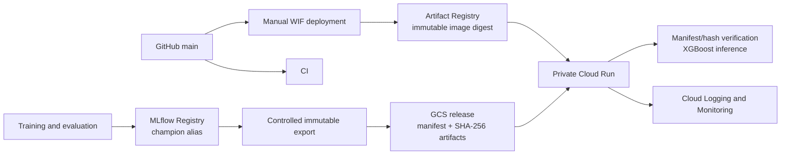

# Fraud Risk Engine Production Finalization Implementation Plan

> **For agentic workers:** REQUIRED SUB-SKILL: Use superpowers:subagent-driven-development (recommended) or superpowers:executing-plans to implement this plan task-by-task. Steps use checkbox (`- [ ]`) syntax for tracking.

**Goal:** Complete deployment automation, minimal production observability, production documentation, and a final evidence-backed audit without changing the approved model or exposing the API publicly.

**Architecture:** Keep MLflow in training and governance only. A manually dispatched GitHub Actions workflow authenticates through GitHub OIDC and GCP Workload Identity Federation, builds an immutable image, deploys a zero-traffic tagged Cloud Run revision, runs authenticated smoke tests, and then moves traffic. Cloud Run continues loading the existing immutable, hash-verified GCS release with its dedicated runtime service account.

**Tech Stack:** Python 3.14, FastAPI, pytest, Python stdlib logging, Docker Buildx, GitHub Actions, Google Cloud Workload Identity Federation, Artifact Registry, Cloud Run, GCS, Cloud Logging, and Cloud Monitoring.

**Spec:** This plan incorporates the user-approved 2026-08-21 production-finalization brief in the constraints and tasks below; no separate tracked specification exists.

## Global Constraints

- Keep `fraud-risk-api` private; never grant `allUsers` or `allAuthenticatedUsers`.
- Never modify `bac-exercise-generator-prod`; every Fraud Risk mutation must use `--project=fraud-risk-engine`.
- Do not change the configured global/default gcloud project.
- Preserve model version `2`, threshold `0.90`, model ID `m-3e65f5fd985a4b6f929abc2057fc7a89`, and release `gs://fraud-risk-engine-models/releases/v2-3e65f5fd-88b81f0/`.
- Preserve the MLflow champion and do not retrain, re-export, overwrite, or mutate the model release.
- Preserve the separate runtime identity `fraud-risk-api-runtime@fraud-risk-engine.iam.gserviceaccount.com`.
- Use no service-account JSON key, long-lived credential, GitHub secret, public endpoint, Cloud SQL, GKE, Airflow, Redis, Terraform, Prometheus, Grafana, or production MLflow server.
- Use TDD for Python behavior changes: test fails for the intended reason, minimal implementation, test passes.
- Use preflight/describe, one minimal mutation, and describe/verify for every GCP or GitHub mutation.
- Do not push, dispatch, change IAM, create monitoring resources, or update Cloud Run until the corresponding task receives explicit execution authorization.
- All completion claims require fresh command output.

---

## Verified Starting State

- Git HEAD and `origin/main`: `88b81f0017c8d90457e16ffeeebb02dbe1642e1b`.
- Existing GitHub workflow: `.github/workflows/ci.yml`; latest run `32484907972` succeeded.
- GitHub repository: private `allwiew99/fraud-risk-engine`; repository ID `1341035951`; owner ID `183977226`.
- No GitHub deployment workflow, Actions variables, Actions environment, or Actions secret exists.
- GCP project `fraud-risk-engine` is ACTIVE; project number `966306760612`.
- Global gcloud default remains the unrelated `bac-exercise-generator-prod`.
- No Workload Identity Pool, provider, or GitHub deployer service account exists.
- `iamcredentials.googleapis.com` and `monitoring.googleapis.com` are enabled; `sts.googleapis.com` is not enabled.
- No Cloud Monitoring alert policy or notification channel exists.
- Cloud Run revision `fraud-risk-api-00001-l7q` is private and Ready.
- Artifact Registry contains the approved image index digest `sha256:7e3319a126b12fc6d8daa4f784e6e965e35f8be28da8b00ac019fd0107921d32`.
- The GCS release contains exactly `manifest.json`, `xgb_champion.ubj`, and `xgb_preprocessor.joblib`.
- Current default pytest suite has 27 tests; the MLflow integration suite has 2 tests.

## Definition of 100%

Completion means all of the following are true at the same final Git commit:

1. Safe structured application/model and prediction events are visible in Cloud Logging without request features or credentials.
2. A separate `workflow_dispatch` deployment workflow uses WIF, immutable image/model identifiers, a zero-traffic candidate revision, authenticated smoke tests, promotion, and rollback.
3. The runtime service account keeps only bucket-level `roles/storage.objectViewer`.
4. The deployer identity has no project-wide role and no role beyond repository writing, one-service deployment/invocation, and `actAs` on the runtime account.
5. One sustained Cloud Run 5xx-rate alert policy exists; built-in Cloud Run metrics remain the source for request count, latency, instances, CPU, and memory.
6. README documents the measured ML results, real production architecture, release/deploy/rollback procedures, security model, observability, settings, and limitations.
7. Local tests/build/runtime, GitHub CI/manual deployment, GCP serving, observability, security, and repository hygiene all pass the final matrix in Task 9.

## File Map

### Create

- `src/fraud_risk/observability.py` — JSON formatter, application logger configuration, safe event whitelist, and release-name extraction.
- `tests/test_observability.py` — six tests for safe structured startup/prediction logging.
- `scripts/smoke_cloud_run.py` — private Cloud Run health/readiness and known-sample smoke client.
- `tests/test_smoke_cloud_run.py` — four tests for authentication, endpoints, and prediction comparisons.
- `.github/workflows/deploy.yml` — manually dispatched WIF build/deploy/smoke/promote workflow.
- `monitoring/cloud-run-5xx-rate-policy.json` — reproducible Cloud Monitoring ratio alert definition.

### Modify

- `src/fraud_risk/model_service.py:1-68` — emit model-load, prediction, and safe failure events.
- `src/fraud_risk/api.py:1-32` — configure application logging and let model service own startup events.
- `pyproject.toml:43-50` — add the two new fast test files to default collection.
- `.gitignore:1-32` — ignore `gha-creds-*.json`.
- `.dockerignore:1-24` — prevent WIF credential files entering Docker context.
- `README.md:1-120` — replace the pre-deployment text with the concise final project/operations document.
- `docs/superpowers/plans/2026-08-21-production-finalization.md` — keep this approved execution record.

### Explicitly Unchanged

- `.github/workflows/ci.yml`
- `Dockerfile`
- `Makefile`
- `src/fraud_risk/config.py`
- `src/fraud_risk/model_bundle.py`
- `src/fraud_risk/release_manifest.py`
- model artifacts, datasets, notebooks, MLflow state, and the current GCS release

## Key Design Decisions

- **Rollout:** deploy with `--no-traffic` and a unique temporary traffic tag, smoke-test the tagged revision, then send 100% to its immutable revision name. This is safer than immediate traffic and remains a short native Cloud Run flow.
- **Rollback:** before deployment, record the current Ready revision. A failure before promotion leaves production unchanged; a failure after promotion runs one traffic rollback to that recorded revision. Do not delete revisions automatically.
- **Logging:** use Python stdlib only. Cloud Run already supplies request logs and platform metrics, so application logs cover only model startup identity/duration, prediction model latency/classification, and safe errors.
- **Monitoring:** one 5xx/total request ratio policy, threshold `> 0.05` for 5 minutes. No custom metric and no invented notification destination.
- **Documentation:** keep one professional README. A separate `docs/architecture.md` would duplicate the concise architecture and is not created.
- **WIF trust:** restrict the provider to numeric GitHub repository/owner IDs, `main`, and the exact deployment workflow ref. Numeric IDs resist repository-name reuse.
- **IAM:** `roles/run.developer` already includes `run.routes.invoke`, so a redundant `roles/run.invoker` binding is not added.
- **Release traceability:** the final serving-code Git SHA and the model manifest's source Git SHA are distinct immutable provenance fields. The existing model release is not re-exported merely because serving/observability code changes.

---

### Task 1: Safe Structured Application Observability

**Mutation boundary:** repository files only.

**Files:**
- Create: `src/fraud_risk/observability.py`
- Create: `tests/test_observability.py`
- Modify: `src/fraud_risk/model_service.py:1-68`
- Modify: `src/fraud_risk/api.py:1-32`
- Modify: `pyproject.toml:43-50`

**Interfaces:**
- Produces: `configure_application_logging() -> logging.Logger`
- Produces: `log_event(logger, level, event, message, **fields) -> None`
- Produces: `release_name_from_uri(uri: str) -> str`
- Consumes: `LoadedModelBundle.manifest.model_version`, `.source_git_commit`, `.threshold`
- Security contract: only whitelisted event fields serialize; request objects, feature values, probabilities, tokens, and credentials are never serialized.

- [ ] **Step 1: Add six failing observability tests**

Create tests with these exact behaviors:

- `test_json_formatter_emits_whitelisted_startup_fields`: build a `LogRecord`
  with every approved startup field, format it, parse it with `json.loads`, and
  compare the full field/value mapping.
- `test_json_formatter_omits_request_payload_and_unknown_fields`: attach
  `request_payload`, `income`, and `token` attributes to a record and assert
  none survive formatting.
- `test_release_name_from_uri_handles_gcs_trailing_slash`: assert the current
  production URI returns `v2-3e65f5fd-88b81f0`.
- `test_initialize_model_logs_verified_manifest_identity_once`: monkeypatch
  `load_model_bundle` and `log_event`, call `initialize_model()` twice, and
  assert one load and one success event.
- `test_initialize_model_failure_logs_type_without_exception_message`:
  raise `RuntimeError("raw-secret-value")` from the loader and assert only
  `RuntimeError` plus the fixed safe message reach `log_event`.
- `test_prediction_logs_model_version_latency_and_classification_only`:
  install a fake loaded model, make one prediction, and assert the event has
  model version, non-negative latency, and classification but no request or
  probability.

The assertions must parse each emitted line with `json.loads` and verify:

```python
assert event["event"] == "model_startup"
assert event["model_version"] == "2"
assert event["model_release"] == "v2-3e65f5fd-88b81f0"
assert event["source_git_commit"] == "88b81f0017c8d90457e16ffeeebb02dbe1642e1b"
assert event["model_load_duration_ms"] >= 0
assert "income" not in event
assert "fraud_probability" not in event
assert "raw-secret-value" not in json.dumps(event)
```

- [ ] **Step 2: Run the new tests and capture the red result**

Run:

```bash
PYTHONPATH=src .venv/bin/python -m pytest tests/test_observability.py -q
```

Expected: collection fails because `fraud_risk.observability` does not exist.

- [ ] **Step 3: Implement the stdlib JSON logger**

Create `src/fraud_risk/observability.py` around this exact public contract:

```python
import json
import logging
import sys
from urllib.parse import urlparse


SAFE_EVENT_FIELDS = (
    "event",
    "model_version",
    "model_release",
    "source_git_commit",
    "model_load_duration_ms",
    "latency_ms",
    "is_fraud",
    "exception_type",
    "error_message",
)


class JsonFormatter(logging.Formatter):
    def format(self, record: logging.LogRecord) -> str:
        payload = {
            "severity": record.levelname,
            "message": record.getMessage(),
        }
        for field in SAFE_EVENT_FIELDS:
            if hasattr(record, field):
                payload[field] = getattr(record, field)
        return json.dumps(payload, separators=(",", ":"), default=str)


def configure_application_logging() -> logging.Logger:
    logger = logging.getLogger("fraud_risk")
    if not any(
        getattr(handler, "_fraud_risk_json", False)
        for handler in logger.handlers
    ):
        handler = logging.StreamHandler(sys.stdout)
        handler.setFormatter(JsonFormatter())
        setattr(handler, "_fraud_risk_json", True)
        logger.addHandler(handler)
    logger.setLevel(logging.INFO)
    logger.propagate = False
    return logger


def log_event(
    logger: logging.Logger,
    level: int,
    event: str,
    message: str,
    **fields,
) -> None:
    safe_fields = {
        key: value
        for key, value in fields.items()
        if key in SAFE_EVENT_FIELDS and key != "event"
    }
    logger.log(level, message, extra={"event": event, **safe_fields})


def release_name_from_uri(uri: str) -> str:
    path = urlparse(uri).path.rstrip("/")
    return path.rsplit("/", 1)[-1]
```

Use the private handler marker shown above instead of suppressing type checks;
no new dependency is introduced.

- [ ] **Step 4: Emit startup and prediction events in `model_service.py`**

Add `logging`, `time.perf_counter`, the observability helpers, and a module logger. Preserve the existing cache/error behavior. Emit:

```python
log_event(
    logger,
    logging.INFO,
    "model_startup",
    "Verified model release loaded",
    model_version=_model.manifest.model_version,
    model_release=release_name_from_uri(MODEL_ARTIFACT_URI),
    source_git_commit=_model.manifest.source_git_commit,
    model_load_duration_ms=round((perf_counter() - started_at) * 1000, 3),
)
```

On initialization failure, emit only fixed safe text:

```python
log_event(
    logger,
    logging.ERROR,
    "model_startup_failed",
    "Model release initialization failed",
    model_release=release_name_from_uri(MODEL_ARTIFACT_URI),
    model_load_duration_ms=round((perf_counter() - started_at) * 1000, 3),
    exception_type=type(error).__name__,
    error_message="Model release initialization failed",
)
```

Wrap prediction timing without changing probability or threshold behavior. On success emit `prediction_completed` with `model_version`, `latency_ms`, and `is_fraud`. On error emit `prediction_failed`, `exception_type`, and fixed `error_message="Prediction failed"`; re-raise the original exception. Never pass `request.model_dump()`, feature names/values, or probability to logging.

- [ ] **Step 5: Configure the application logger in `api.py`**

Call `configure_application_logging()` once during module initialization. Keep lifespan responsible only for calling `initialize_model()`:

```python
configure_application_logging()


@asynccontextmanager
async def lifespan(app: FastAPI):
    initialize_model()
    yield
```

Remove the old unstructured startup/error logging and unused `get_model_load_error` import. Preserve `/health`, `/ready`, `/predict`, and exception responses exactly.

- [ ] **Step 6: Add the new test file to default pytest collection**

Append:

```toml
"tests/test_observability.py",
```

to `[tool.pytest.ini_options].testpaths`. Do not change dependencies.

- [ ] **Step 7: Run focused and default tests**

```bash
PYTHONPATH=src .venv/bin/python -m pytest tests/test_observability.py tests/test_model_service.py tests/test_api.py -q
PYTHONPATH=src .venv/bin/python -m pytest -q
```

Expected: six new observability tests pass and the complete service-independent suite has 33 passing tests.

- [ ] **Step 8: Commit the independently verified change**

```bash
git add src/fraud_risk/observability.py src/fraud_risk/model_service.py src/fraud_risk/api.py tests/test_observability.py pyproject.toml
git diff --cached --check
git commit -m "Add safe structured production observability"
```

Rollback: revert this commit; no cloud resource changes in this task.

---

### Task 2: Authenticated Cloud Run Smoke Client and Credential Hygiene

**Mutation boundary:** repository files only.

**Files:**
- Create: `scripts/smoke_cloud_run.py`
- Create: `tests/test_smoke_cloud_run.py`
- Modify: `pyproject.toml:43-50`
- Modify: `.gitignore:1-32`
- Modify: `.dockerignore:1-24`

**Interfaces:**
- Produces: `SmokeCheckError(RuntimeError)`
- Produces: `run_smoke_tests(service_url: str, identity_token: str, opener=urlopen) -> dict`
- Consumes: `CLOUD_RUN_ID_TOKEN` environment variable in CLI mode.
- Output: endpoint status and probability differences only; never the token or input features.

- [ ] **Step 1: Write four failing smoke-client tests**

- `test_smoke_requires_unauthenticated_health_to_be_403`: make the fake opener
  return `200` for the uncredentialed request and assert `SmokeCheckError`.
- `test_smoke_accepts_expected_health_and_readiness`: return `403`, then the
  exact health/readiness bodies, and assert both authenticated statuses.
- `test_smoke_accepts_both_known_prediction_contracts`: return both exact
  predictions and assert zero absolute difference.
- `test_smoke_rejects_probability_or_classification_mismatch`: change the
  positive response to `is_fraud=false` and assert `SmokeCheckError`.

Use a fake opener that records URL, HTTP method, and whether an Authorization header exists. Return these exact successful bodies:

```json
{"status":"ok"}
{"status":"ready"}
{"fraud_probability":0.13046391308307648,"is_fraud":false,"threshold":0.9}
{"fraud_probability":0.9620175957679749,"is_fraud":true,"threshold":0.9}
```

Assert the serialized result never contains the token or any feature name.

- [ ] **Step 2: Verify the tests fail because the client is absent**

```bash
PYTHONPATH=src .venv/bin/python -m pytest tests/test_smoke_cloud_run.py -q
```

Expected: import failure for `scripts.smoke_cloud_run`.

- [ ] **Step 3: Implement the stdlib-only smoke client**

The implementation must:

1. send unauthenticated `GET /health` and require `403`;
2. send authenticated `GET /health` and require `200` plus `{"status":"ok"}`;
3. send authenticated `GET /ready` and require `200` plus `{"status":"ready"}`;
4. send the exact negative and positive payloads already recorded in `tests/integration/test_release_equivalence.py`;
5. require threshold `0.9`, negative `is_fraud=false`, positive `is_fraud=true`;
6. compare probabilities with absolute tolerances `1e-7` and `1e-6`;
7. read `CLOUD_RUN_ID_TOKEN` from the environment and never print it.

The CLI contract is:

```bash
CLOUD_RUN_ID_TOKEN="$(gcloud auth print-identity-token \
  --audiences=https://fraud-risk-api-74lquku5ia-ew.a.run.app)" \
  python scripts/smoke_cloud_run.py \
  --service-url="https://fraud-risk-api-74lquku5ia-ew.a.run.app"
```

The success summary contains only:

```json
{
  "health": 200,
  "ready": 200,
  "negative_probability": 0.13046391308307648,
  "negative_absolute_difference": 0.0,
  "positive_probability": 0.9620175957679749,
  "positive_absolute_difference": 0.0
}
```

- [ ] **Step 4: Protect generated WIF credential files**

Add this exact rule to both ignore files:

```text
gha-creds-*.json
```

This is required because `google-github-actions/auth` can create a short-lived credential file in the workspace before Docker build context is assembled.

- [ ] **Step 5: Add smoke tests to default collection**

Append `"tests/test_smoke_cloud_run.py"` to `pyproject.toml` testpaths.

- [ ] **Step 6: Run the focused/default tests and credential checks**

```bash
PYTHONPATH=src .venv/bin/python -m pytest tests/test_smoke_cloud_run.py -q
PYTHONPATH=src .venv/bin/python -m pytest -q
git check-ignore --no-index gha-creds-example.json
docker buildx build --platform linux/amd64 --load -t fraud-risk-engine:smoke-client-check .
docker run --rm fraud-risk-engine:smoke-client-check \
  sh -c 'test ! -e /app/gha-creds-example.json'
```

Expected: four smoke-client tests pass, default suite has 37 passing tests, the credential filename is ignored, and the image contains no generated credential file.

- [ ] **Step 7: Commit**

```bash
git add scripts/smoke_cloud_run.py tests/test_smoke_cloud_run.py pyproject.toml .gitignore .dockerignore
git diff --cached --check
git commit -m "Add private Cloud Run smoke verification"
```

Rollback: revert this commit; no remote request is made by the unit tests.

---

### Task 3: Manual WIF Deployment Workflow

**Mutation boundary:** repository workflow only. Do not run or push it in this task.

**Files:**
- Create: `.github/workflows/deploy.yml`

**Interfaces:**
- Inputs: `model_release` default `v2-3e65f5fd-88b81f0`; `model_version` default `"2"`.
- GitHub variables: `GCP_WORKLOAD_IDENTITY_PROVIDER`, `GCP_DEPLOYER_SERVICE_ACCOUNT`.
- Produces: immutable image digest, zero-traffic candidate revision, authenticated smoke evidence, promoted revision, and step summary.

- [ ] **Step 1: Create the workflow with an explicit manual gate**

Use:

```yaml
name: Deploy production

on:
  workflow_dispatch:
    inputs:
      model_release:
        description: Immutable GCS release directory name
        required: true
        default: v2-3e65f5fd-88b81f0
        type: string
      model_version:
        description: Immutable registered model version
        required: true
        default: "2"
        type: string

permissions:
  contents: read

concurrency:
  group: fraud-risk-production-deploy
  cancel-in-progress: false

jobs:
  deploy:
    if: github.ref == 'refs/heads/main'
    runs-on: ubuntu-latest
    timeout-minutes: 60
    permissions:
      contents: read
      id-token: write
    env:
      GCP_PROJECT_ID: fraud-risk-engine
      GCP_PROJECT_NUMBER: "966306760612"
      GCP_REGION: europe-west1
      ARTIFACT_REPOSITORY: fraud-risk-engine
      CLOUD_RUN_SERVICE: fraud-risk-api
      RUNTIME_SERVICE_ACCOUNT: fraud-risk-api-runtime@fraud-risk-engine.iam.gserviceaccount.com
      MODEL_BUCKET: fraud-risk-engine-models
```

`workflow_dispatch` is the initial manual approval boundary. Do not add `push`, `pull_request`, or `schedule`.

- [ ] **Step 2: Pin all deployment actions to the inspected immutable SHAs**

Use these exact references with version comments:

```yaml
uses: actions/checkout@3d3c42e5aac5ba805825da76410c181273ba90b1 # v7
uses: actions/setup-python@5fda3b95a4ea91299a34e894583c3862153e4b97 # v7
uses: google-github-actions/auth@7c6bc770dae815cd3e89ee6cdf493a5fab2cc093 # v3
uses: google-github-actions/setup-gcloud@aa5489c8933f4cc7a4f7d45035b3b1440c9c10db # v3
uses: docker/setup-buildx-action@8d2750c68a42422c14e847fe6c8ac0403b4cbd6f # v3
```

The auth step uses only:

```yaml
with:
  project_id: ${{ env.GCP_PROJECT_ID }}
  workload_identity_provider: ${{ vars.GCP_WORKLOAD_IDENTITY_PROVIDER }}
  service_account: ${{ vars.GCP_DEPLOYER_SERVICE_ACCOUNT }}
```

- [ ] **Step 3: Add source/input and private-service preflight**

The workflow must:

```bash
test "$(git rev-parse HEAD)" = "$GITHUB_SHA"
test "$GITHUB_REF" = "refs/heads/main"
[[ "$MODEL_VERSION" =~ ^[1-9][0-9]*$ ]]
[[ "$MODEL_RELEASE" =~ ^v[1-9][0-9]*-[a-z0-9][a-z0-9-]*$ ]]
[[ "$MODEL_RELEASE" == "v$MODEL_VERSION-"* ]]
```

Derive:

```bash
SHORT_SHA="${GITHUB_SHA:0:7}"
IMAGE_TAG="${SHORT_SHA}-${MODEL_RELEASE}"
IMAGE="europe-west1-docker.pkg.dev/fraud-risk-engine/fraud-risk-engine/fraud-risk-engine"
MODEL_ARTIFACT_URI="gs://fraud-risk-engine-models/releases/${MODEL_RELEASE}/"
```

Describe the existing service and fail if it does not exist. Record `status.latestReadyRevisionName` as `previous_revision` and `status.url` as the identity-token audience. Read service IAM and fail if `allUsers` or `allAuthenticatedUsers` is present. Do not call an IAM mutation command.

- [ ] **Step 4: Run tests, authenticate, check tag absence, build, and push once**

Run the same default test command as CI before authentication:

```bash
python -m pip install --upgrade pip setuptools
python -m pip install --editable ".[dev]"
PYTHONPATH=src python -m pytest -q
```

After WIF authentication and `setup-gcloud`, configure only `europe-west1-docker.pkg.dev`. Query Artifact Registry and fail if `IMAGE_TAG` already exists. Then execute one build/push:

```bash
docker buildx build \
  --platform linux/amd64 \
  --label "org.opencontainers.image.revision=$GITHUB_SHA" \
  --label "org.opencontainers.image.source=https://github.com/allwiew99/fraud-risk-engine" \
  --label "org.opencontainers.image.version=$IMAGE_TAG" \
  --label "com.fraud-risk.model.version=$MODEL_VERSION" \
  --label "com.fraud-risk.model.release=$MODEL_RELEASE" \
  --label "com.fraud-risk.model.uri=$MODEL_ARTIFACT_URI" \
  --tag "$IMAGE:$IMAGE_TAG" \
  --cache-from type=gha \
  --cache-to type=gha,mode=max \
  --push \
  .
```

Use `docker buildx imagetools inspect` and Artifact Registry listing to capture and cross-check the `sha256:` index digest. All deployment steps use `IMAGE@DIGEST`, never the tag.

- [ ] **Step 5: Deploy a zero-traffic tagged candidate**

Use a unique tag:

```bash
CANDIDATE_TAG="candidate-${GITHUB_RUN_ID}-${GITHUB_RUN_ATTEMPT}"
```

Deploy with:

```bash
gcloud run deploy fraud-risk-api \
  --image="$IMAGE@$DIGEST" \
  --region=europe-west1 \
  --project=fraud-risk-engine \
  --platform=managed \
  --service-account=fraud-risk-api-runtime@fraud-risk-engine.iam.gserviceaccount.com \
  --set-env-vars="MODEL_ARTIFACT_URI=$MODEL_ARTIFACT_URI" \
  --cpu=1 \
  --memory=1Gi \
  --min=0 \
  --max=3 \
  --concurrency=4 \
  --timeout=60 \
  --cpu-boost \
  --no-traffic \
  --tag="$CANDIDATE_TAG" \
  --quiet
```

Do not pass `--allow-unauthenticated` or mutate service IAM. Verify the old revision still has 100% ordinary traffic and the new revision has 0%.

- [ ] **Step 6: Smoke candidate, promote, and smoke canonical route**

Get a Google-signed identity token with the canonical service URL as audience, mask it immediately, and expose it only through `CLOUD_RUN_ID_TOKEN`:

```bash
IDENTITY_TOKEN="$(gcloud auth print-identity-token --audiences="$SERVICE_URL")"
echo "::add-mask::$IDENTITY_TOKEN"
echo "CLOUD_RUN_ID_TOKEN=$IDENTITY_TOKEN" >> "$GITHUB_ENV"
```

Run:

```bash
python scripts/smoke_cloud_run.py --service-url="$CANDIDATE_URL"
gcloud run services update-traffic fraud-risk-api \
  --to-revisions="$CANDIDATE_REVISION=100" \
  --region=europe-west1 \
  --project=fraud-risk-engine \
  --quiet
python scripts/smoke_cloud_run.py --service-url="$SERVICE_URL"
```

On success, remove the temporary candidate traffic tag. Re-read service IAM and require it to remain private.

- [ ] **Step 7: Add automatic traffic-only rollback**

Add an `if: failure() && steps.promote.outcome == 'success'` step:

```bash
gcloud run services update-traffic fraud-risk-api \
  --to-revisions="$PREVIOUS_REVISION=100" \
  --region=europe-west1 \
  --project=fraud-risk-engine \
  --quiet
```

If failure occurs before promotion, production traffic already remains on `PREVIOUS_REVISION`; do not issue rollback. Never delete the failed candidate revision automatically.

- [ ] **Step 8: Add an always-run summary without sensitive data**

Write Git SHA, model release/version, image tag, image digest, previous revision, candidate revision, final serving revision, and smoke conclusion to `$GITHUB_STEP_SUMMARY`. Never include identity tokens, credentials-file contents, prediction inputs, or GCS object contents.

- [ ] **Step 9: Validate workflow syntax locally**

```bash
ruby -e 'require "yaml"; YAML.safe_load_file(".github/workflows/deploy.yml", aliases: true)'
git diff --check
rg -n 'latest|champion|current|allow-unauthenticated|credentials_json|service_account_key' .github/workflows/deploy.yml
```

Expected: YAML parses; forbidden production identifiers/auth modes are absent. `latest` may appear only as a Cloud Run status field name used for verification, not as an image/model identifier.

- [ ] **Step 10: Commit without pushing**

```bash
git add .github/workflows/deploy.yml
git diff --cached --check
git commit -m "Add manual immutable Cloud Run deployment"
```

Rollback: revert the commit. Since the workflow has not been pushed or dispatched, no GitHub/GCP state changes.

---

### Task 4: Reproducible Minimal Cloud Monitoring Policy

**Mutation boundary:** repository file only; policy creation is deferred to Task 8.

**Files:**
- Create: `monitoring/cloud-run-5xx-rate-policy.json`

**Interfaces:**
- Consumes built-in `run.googleapis.com/request_count`.
- Numerator: service/location 5xx request count.
- Denominator: all service/location request count.
- Produces one enabled incident policy with no notification channel.

- [ ] **Step 1: Create the exact policy definition**

```json
{
  "displayName": "Fraud Risk API sustained 5xx rate",
  "combiner": "OR",
  "enabled": true,
  "documentation": {
    "content": "The fraud-risk-api 5xx ratio exceeded 5% for five minutes. Inspect the latest Cloud Run revision, structured model_startup/model_startup_failed events, and request logs. No notification channel is configured; incidents are visible in Cloud Monitoring.",
    "mimeType": "text/markdown"
  },
  "conditions": [
    {
      "displayName": "5xx responses exceed 5% for 5 minutes",
      "conditionThreshold": {
        "filter": "metric.type=\"run.googleapis.com/request_count\" AND resource.type=\"cloud_run_revision\" AND resource.label.service_name=\"fraud-risk-api\" AND resource.label.location=\"europe-west1\" AND metric.label.response_code_class=\"5xx\"",
        "denominatorFilter": "metric.type=\"run.googleapis.com/request_count\" AND resource.type=\"cloud_run_revision\" AND resource.label.service_name=\"fraud-risk-api\" AND resource.label.location=\"europe-west1\"",
        "aggregations": [
          {
            "alignmentPeriod": "60s",
            "perSeriesAligner": "ALIGN_DELTA",
            "crossSeriesReducer": "REDUCE_SUM",
            "groupByFields": ["resource.label.service_name"]
          }
        ],
        "denominatorAggregations": [
          {
            "alignmentPeriod": "60s",
            "perSeriesAligner": "ALIGN_DELTA",
            "crossSeriesReducer": "REDUCE_SUM",
            "groupByFields": ["resource.label.service_name"]
          }
        ],
        "comparison": "COMPARISON_GT",
        "thresholdValue": 0.05,
        "duration": "300s",
        "trigger": {"count": 1},
        "evaluationMissingData": "EVALUATION_MISSING_DATA_INACTIVE"
      }
    }
  ],
  "alertStrategy": {"autoClose": "1800s"}
}
```

- [ ] **Step 2: Validate JSON and exact scope**

```bash
python3 -m json.tool monitoring/cloud-run-5xx-rate-policy.json >/dev/null
python3 - <<'PY'
import json
policy = json.load(open("monitoring/cloud-run-5xx-rate-policy.json"))
assert policy["enabled"] is True
assert policy.get("notificationChannels", []) == []
condition = policy["conditions"][0]["conditionThreshold"]
assert condition["thresholdValue"] == 0.05
assert condition["duration"] == "300s"
assert 'service_name="fraud-risk-api"' in condition["filter"]
assert 'location="europe-west1"' in condition["filter"]
PY
```

- [ ] **Step 3: Commit**

```bash
git add monitoring/cloud-run-5xx-rate-policy.json
git diff --cached --check
git commit -m "Add minimal Cloud Run failure alert policy"
```

Rollback: revert the commit; no alert policy exists remotely yet.

---

### Task 5: Final Professional README

**Mutation boundary:** repository documentation only.

**Files:**
- Modify: `README.md:1-120`
- Include: `docs/superpowers/plans/2026-08-21-production-finalization.md`

- [ ] **Step 1: Replace the pre-deployment README with the actual system**

Use this concise section order:

1. Problem and why fraud detection is imbalanced/time-sensitive.
2. Dataset and temporal split.
3. Model comparison and threshold decision.
4. Final model and immutable release contract.
5. Production architecture diagram.
6. API endpoints and production settings.
7. MLflow governance role.
8. CI, integration, and manual deployment workflows.
9. Security/IAM.
10. Observability and alert behavior.
11. Local setup, tests, Docker, release, deployment, rollback.
12. Limitations and future work.

Record these measured dataset values:

| Split | Months | Rows | Fraud rate |
|---|---:|---:|---:|
| Train | 0–5 | 794,989 | 1.0253% |
| Validation | 6 | 108,168 | 1.3405% |
| Test | 7 | 96,843 | 1.4746% |

Record these held-out model values already present in the sanitized notebook:

| Model | Threshold | Precision | Recall | F1 | ROC-AUC | PR-AUC |
|---|---:|---:|---:|---:|---:|---:|
| Logistic Regression | 0.91 | 0.2744 | 0.1933 | 0.2268 | 0.8815 | 0.1791 |
| XGBoost | 0.90 | 0.2649 | 0.2276 | 0.2448 | 0.8918 | 0.1902 |
| PyTorch MLP | 0.93 | 0.2382 | 0.2941 | 0.2632 | 0.8877 | 0.1885 |

Explain that XGBoost was selected for the strongest ROC-AUC/PR-AUC plus simpler native production serialization, while threshold `0.90` makes the alert-volume/precision-recall tradeoff explicit.

- [ ] **Step 2: Add one architecture diagram**



State clearly that MLflow is not in the request path.

- [ ] **Step 3: Document exact operational procedures**

Include:

```bash
make test
make test-integration
make docker-build-amd64
make export-model-release
gh workflow run deploy.yml --ref main \
  -f model_release=v2-3e65f5fd-88b81f0 \
  -f model_version=2
```

Rollback:

```bash
TARGET_REVISION=fraud-risk-api-00001-l7q
gcloud run services update-traffic fraud-risk-api \
  --to-revisions="${TARGET_REVISION}=100" \
  --region=europe-west1 \
  --project=fraud-risk-engine
```

The target revision is selected read-only from:

```bash
gcloud run revisions list \
  --service=fraud-risk-api \
  --region=europe-west1 \
  --project=fraud-risk-engine
```

Describe known settings: private service, `1 CPU`, `1Gi`, concurrency `4`, min `0`, max `3`, timeout `60s`, startup CPU boost, immutable GCS URI, and bucket-only runtime read access.

- [ ] **Step 4: State limitations without adding infrastructure**

List: single region, scale-to-zero cold start around 10 seconds, no public end-user authentication layer, no real-time drift feedback loop, notification channel intentionally absent, manual release promotion, and local-only training/MLflow state.

- [ ] **Step 5: Review README accuracy and size**

```bash
rg -n 'future Cloud Run|host.docker.internal|latest|champion|current|allow-unauthenticated|Cloud SQL|Kubernetes|Terraform' README.md
wc -l README.md
git diff --check
```

Expected: `champion` appears only in the MLflow governance/export explanation; mutable identifiers do not appear as production runtime references. Keep README near 250–350 lines.

- [ ] **Step 6: Commit README and this approved plan**

```bash
git add README.md docs/superpowers/plans/2026-08-21-production-finalization.md
git diff --cached --check
git commit -m "Document final production architecture and operations"
```

Rollback: revert the documentation commit.

---

### Task 6: WIF and Least-Privilege Deployer Foundation

**Mutation boundary:** enables one GCP API; creates one WIF pool, one provider, one deployer service account; adds four resource-level IAM bindings; creates two non-secret GitHub Actions variables. No repository, bucket, Artifact Registry content, Cloud Run revision, or BAC mutation.

**Cloud resources:**
- API: `sts.googleapis.com`
- Pool: `github-actions`
- Provider: `fraud-risk-engine`
- Service account: `fraud-risk-github-deployer@fraud-risk-engine.iam.gserviceaccount.com`

- [ ] **Step 1: Read-only preflight and stop on conflicts**

```bash
gcloud auth list
gcloud config get-value project
gcloud projects describe fraud-risk-engine
gcloud iam workload-identity-pools list \
  --location=global --project=fraud-risk-engine
gcloud iam service-accounts describe \
  fraud-risk-github-deployer@fraud-risk-engine.iam.gserviceaccount.com \
  --project=fraud-risk-engine
```

Expected: active account `stamalaurentiu0@gmail.com`, default project still BAC, pool/provider/deployer absent. If a same-name resource exists with different configuration, stop before mutation.

- [ ] **Step 2: Enable only Security Token Service**

```bash
gcloud services enable sts.googleapis.com \
  --project=fraud-risk-engine
```

Verify `sts.googleapis.com`, `iam.googleapis.com`, and `iamcredentials.googleapis.com` are enabled. Enable no other API.

- [ ] **Step 3: Create the deployer service account and WIF pool**

```bash
gcloud iam service-accounts create fraud-risk-github-deployer \
  --display-name="Fraud Risk GitHub Deployer" \
  --project=fraud-risk-engine

gcloud iam workload-identity-pools create github-actions \
  --location=global \
  --display-name="GitHub Actions" \
  --description="Keyless deployment identities for allwiew99/fraud-risk-engine" \
  --project=fraud-risk-engine
```

- [ ] **Step 4: Create the OIDC provider with numeric and workflow restrictions**

```bash
gcloud iam workload-identity-pools providers create-oidc fraud-risk-engine \
  --location=global \
  --workload-identity-pool=github-actions \
  --display-name="Fraud Risk Engine GitHub" \
  --issuer-uri="https://token.actions.githubusercontent.com" \
  --attribute-mapping="google.subject=assertion.sub,attribute.repository_id=assertion.repository_id,attribute.repository_owner_id=assertion.repository_owner_id,attribute.ref=assertion.ref,attribute.workflow_ref=assertion.workflow_ref" \
  --attribute-condition="assertion.repository_id=='1341035951' && assertion.repository_owner_id=='183977226' && assertion.ref=='refs/heads/main' && assertion.workflow_ref=='allwiew99/fraud-risk-engine/.github/workflows/deploy.yml@refs/heads/main'" \
  --project=fraud-risk-engine
```

- [ ] **Step 5: Grant exactly four scoped bindings**

WIF principal to deployer service account:

```bash
gcloud iam service-accounts add-iam-policy-binding \
  fraud-risk-github-deployer@fraud-risk-engine.iam.gserviceaccount.com \
  --member="principalSet://iam.googleapis.com/projects/966306760612/locations/global/workloadIdentityPools/github-actions/attribute.repository_id/1341035951" \
  --role="roles/iam.workloadIdentityUser" \
  --project=fraud-risk-engine
```

Artifact Registry repository:

```bash
gcloud artifacts repositories add-iam-policy-binding fraud-risk-engine \
  --location=europe-west1 \
  --member="serviceAccount:fraud-risk-github-deployer@fraud-risk-engine.iam.gserviceaccount.com" \
  --role="roles/artifactregistry.writer" \
  --project=fraud-risk-engine
```

Existing Cloud Run service:

```bash
gcloud run services add-iam-policy-binding fraud-risk-api \
  --region=europe-west1 \
  --member="serviceAccount:fraud-risk-github-deployer@fraud-risk-engine.iam.gserviceaccount.com" \
  --role="roles/run.developer" \
  --project=fraud-risk-engine
```

Runtime service account:

```bash
gcloud iam service-accounts add-iam-policy-binding \
  fraud-risk-api-runtime@fraud-risk-engine.iam.gserviceaccount.com \
  --member="serviceAccount:fraud-risk-github-deployer@fraud-risk-engine.iam.gserviceaccount.com" \
  --role="roles/iam.serviceAccountUser" \
  --project=fraud-risk-engine
```

Do not add `roles/run.invoker`; `roles/run.developer` already contains `run.routes.invoke`. Do not add any project-level binding.

- [ ] **Step 6: Create two non-secret GitHub variables**

```bash
gh variable set GCP_WORKLOAD_IDENTITY_PROVIDER \
  --repo allwiew99/fraud-risk-engine \
  --body "projects/966306760612/locations/global/workloadIdentityPools/github-actions/providers/fraud-risk-engine"

gh variable set GCP_DEPLOYER_SERVICE_ACCOUNT \
  --repo allwiew99/fraud-risk-engine \
  --body "fraud-risk-github-deployer@fraud-risk-engine.iam.gserviceaccount.com"
```

No GitHub secret or JSON key is created.

- [ ] **Step 7: Describe and verify least privilege**

Describe pool, provider condition/mappings, deployer account, deployer account IAM, repository IAM, service IAM, runtime account IAM, bucket IAM, and project IAM. Assert:

- deployer has no project-level binding;
- repository has only deployer `roles/artifactregistry.writer` added;
- service has only deployer `roles/run.developer` added and no public member;
- runtime account has only deployer `roles/iam.serviceAccountUser` added;
- bucket still grants runtime account only `roles/storage.objectViewer`;
- service-account key lists are empty for runtime and deployer;
- BAC has no Fraud Risk resources.

Rollback, if verification fails:

1. remove the four bindings in reverse order;
2. delete the provider, pool, and deployer account only after their exact names are re-described;
3. disable STS only if no other Fraud Risk WIF consumer exists;
4. delete the two GitHub variables.

Stop for approval before any rollback deletion.

---

### Task 7: Push Final Source and Validate Existing CI

**Mutation boundary:** GitHub Git history and Actions runs only. No deployment workflow dispatch yet.

- [ ] **Step 1: Run the complete local gate**

```bash
PYTHONPATH=src .venv/bin/python -m pytest -q
PYTHONPATH=src .venv/bin/python -m pytest -m integration tests/integration -q
git diff --check
docker buildx build --platform linux/amd64 --load \
  -t fraud-risk-engine:final-local .
```

Run the image with the existing ignored local release, with MLflow variables unset, and verify `/health`, `/ready`, and both predictions. Expected fast count: 37. Expected integration count: 2.

- [ ] **Step 2: Verify commits and staging safety**

```bash
git status --short
git log --oneline 88b81f0..HEAD
git ls-files | rg '(^data/raw/|mlflow.db|mlartifacts|\.(joblib|ubj)$|^dist/model-release/)'
git diff 88b81f0..HEAD --check
```

Expected: only approved finalization files changed; generated/private matches are zero.

- [ ] **Step 3: Push normally and watch CI**

```bash
git push origin main
RUN_ID="$(gh run list --repo allwiew99/fraud-risk-engine \
  --workflow CI --limit 1 --json databaseId --jq '.[0].databaseId')"
gh run watch "$RUN_ID" \
  --repo allwiew99/fraud-risk-engine \
  --exit-status
```

Verify fast tests and Docker build both succeed. On failure, stop without dispatching deployment.

- [ ] **Step 4: Confirm GitHub accepted the deployment workflow**

```bash
gh workflow view deploy.yml \
  --repo allwiew99/fraud-risk-engine \
  --yaml
git rev-parse HEAD
git ls-remote origin refs/heads/main
```

Rollback: revert through a new commit only after diagnosis; never force-push.

---

### Task 8: Real Manual Deployment and Monitoring Validation

**Mutation boundary:** one new immutable Artifact Registry image/tag, one Cloud Run candidate revision/traffic update, and one Cloud Monitoring alert policy. Existing GCS release and IAM remain unchanged.

- [ ] **Step 1: Dispatch the workflow from final `main`**

```bash
gh workflow run deploy.yml \
  --repo allwiew99/fraud-risk-engine \
  --ref main \
  -f model_release=v2-3e65f5fd-88b81f0 \
  -f model_version=2

DEPLOY_RUN_ID="$(gh run list \
  --repo allwiew99/fraud-risk-engine \
  --workflow deploy.yml \
  --event workflow_dispatch \
  --limit 1 \
  --json databaseId \
  --jq '.[0].databaseId')"

gh run watch "$DEPLOY_RUN_ID" \
  --repo allwiew99/fraud-risk-engine \
  --exit-status
```

If WIF authentication fails immediately after foundation creation, allow the documented propagation window and inspect the unchanged provider/bindings; do not alter IAM or create a key. A failed workflow requires a fresh separate dispatch only after diagnosis and approval.

- [ ] **Step 2: Verify workflow and production evidence**

```bash
gh run view "$DEPLOY_RUN_ID" \
  --repo allwiew99/fraud-risk-engine \
  --json headSha,status,conclusion,jobs,url
```

Verify:

- run head SHA equals remote `main`;
- tests pass;
- exactly one new immutable tag exists;
- OCI index includes `linux/amd64`;
- labels match final Git SHA, model version, release, and GCS URI;
- candidate revision was 0% before smoke;
- candidate/private smoke passed;
- final canonical/private smoke passed;
- exactly one revision serves 100%;
- temporary candidate tag is removed;
- service IAM has no public member.

- [ ] **Step 3: Verify structured production logs**

```bash
gcloud logging read \
  'resource.type="cloud_run_revision" AND resource.labels.service_name="fraud-risk-api" AND jsonPayload.event="model_startup"' \
  --project=fraud-risk-engine \
  --limit=10 \
  --format=json

gcloud logging read \
  'resource.type="cloud_run_revision" AND resource.labels.service_name="fraud-risk-api" AND jsonPayload.event="prediction_completed"' \
  --project=fraud-risk-engine \
  --limit=10 \
  --format=json
```

Require model version/release/source commit/duration on startup and model version/latency/classification on predictions. Search the new revision logs for `income`, `name_email_similarity`, bearer tokens, and credentials; require zero matches.

- [ ] **Step 4: Create the one alert policy**

Preflight must still show zero same-name policies and zero notification channels:

```bash
gcloud monitoring policies list \
  --project=fraud-risk-engine \
  --filter='displayName="Fraud Risk API sustained 5xx rate"'

gcloud beta monitoring channels list \
  --project=fraud-risk-engine
```

Create once:

```bash
gcloud monitoring policies create \
  --policy-from-file=monitoring/cloud-run-5xx-rate-policy.json \
  --project=fraud-risk-engine
```

No notification channel is supplied.

- [ ] **Step 5: Verify policy and built-in metrics**

Describe the policy and compare its filters, threshold, duration, enabled state, and empty notification-channel list with the tracked JSON. Confirm Cloud Run built-in metric descriptors cover request count, request latency, instance count, CPU utilization, and memory utilization. Do not create a custom metric or dashboard.

Alert rollback, if the policy is malformed: describe its exact generated name, stop for approval, then delete only that policy. Do not create a replacement in the same turn without diagnosis.

Deployment rollback:

```bash
gcloud run services update-traffic fraud-risk-api \
  --to-revisions="fraud-risk-api-00001-l7q=100" \
  --region=europe-west1 \
  --project=fraud-risk-engine
```

For this first automated rollout, `fraud-risk-api-00001-l7q` is the verified
pre-workflow revision. Future runs must use the workflow's recorded
`previous_revision` output; never infer or delete a revision.

---

### Task 9: Final Production Audit

**Mutation boundary:** read-only. Any discovered correction becomes a new separately reviewed task and, if it affects runtime, requires a new immutable image and deployment.

- [ ] **Step 1: Local verification matrix**

```bash
PYTHONPATH=src .venv/bin/python -m pytest -q
PYTHONPATH=src .venv/bin/python -m pytest -m integration tests/integration -q
git diff --check
docker buildx build --platform linux/amd64 --load \
  -t fraud-risk-engine:final-audit .
```

Expected: 37 fast/default tests, 2 integration tests, clean diff check, successful `linux/amd64` build. Start the image with only `MODEL_ARTIFACT_URI=file:///model-release` and `PORT`; confirm it serves without MLflow.

- [ ] **Step 2: GitHub verification matrix**

- latest CI: success;
- manual deployment workflow: success;
- workflow head SHA equals `origin/main`;
- workflow syntax available through `gh workflow view`;
- WIF used, no secret/key authentication;
- test, build, deploy, candidate smoke, promotion, and final smoke steps all succeeded.

- [ ] **Step 3: GCP verification matrix**

- WIF provider ACTIVE and exact condition intact;
- deployer account has only the four scoped bindings;
- Artifact Registry immutable tag/digest/labels match workflow head SHA and release;
- Cloud Run latest Ready revision uses the expected digest, runtime account, model URI, CPU/memory/concurrency/min/max/timeout/boost;
- `/health`, `/ready`, negative, and positive authenticated calls pass;
- unauthenticated `/health` is `403`;
- GCS still has exactly three objects with original generations/hashes;
- runtime account still has bucket-only `roles/storage.objectViewer`;
- BAC has no Fraud Risk service/repository/bucket/account.

- [ ] **Step 4: Observability/security verification matrix**

- structured startup event visible;
- structured prediction event visible;
- no raw request/features/probabilities/tokens in application logs;
- Cloud Run request/latency/instance/CPU/memory metrics available;
- one enabled sustained-5xx policy exists;
- policy has no invented notification channel;
- runtime and deployer service accounts have zero user-managed keys;
- repository has no `.env`, credentials, raw data, model artifacts, MLflow state, or host-specific absolute paths.

- [ ] **Step 5: Repository final state**

```bash
git status --short
git branch -vv
git rev-parse HEAD
git ls-remote origin refs/heads/main
git log -8 --oneline
```

Expected: clean working tree, local `main` synchronized with `origin/main`, and final deployed image label points to that SHA.

- [ ] **Step 6: Produce the final evidence report**

Report exact test counts, CI/deployment run IDs, final Git SHA, image tag/digest, Cloud Run revision/URL, smoke probabilities/differences, log event examples without sensitive data, alert policy ID, IAM bindings, GCS generations, and remaining limitations. Mark the project 100% only if every matrix row has fresh passing evidence.

---

## Estimated Progress

| After task | Milestone | Estimated overall progress |
|---|---|---:|
| Starting state | Verified private production service | 97.5% |
| Task 1 | Structured safe observability | 98.1% |
| Task 2 | Reusable private smoke verification | 98.5% |
| Task 3 | Manual immutable deployment workflow | 99.0% |
| Task 4 | Reproducible alert definition | 99.2% |
| Task 5 | Final professional documentation | 99.4% |
| Task 6 | Keyless least-privilege WIF foundation | 99.6% |
| Task 7 | Final source on remote with green CI | 99.7% |
| Task 8 | Real workflow deployment and alert | 99.9% |
| Task 9 | Complete fresh audit | 100% |

## Risk Register

1. **WIF propagation delay:** pool/provider/IAM changes can take several minutes. Diagnose and retry the workflow only after verifying unchanged configuration; never fall back to a JSON key.
2. **Workflow trust drift:** renaming `deploy.yml`, changing repository ownership, or dispatching from a non-main ref makes provider authentication fail closed.
3. **Large Docker push:** the image is about 479 MB uncompressed. Keep one push per workflow and a 60-minute job timeout; do not launch parallel retries.
4. **Candidate authentication:** requests target the traffic-tag URL but the ID-token audience remains the canonical service URL.
5. **Low traffic alert behavior:** a ratio policy can remain inactive when there are no requests; missing data is intentionally healthy. No external notification occurs until a real channel is separately approved.
6. **Logging privacy:** exception strings from prediction libraries can contain input-derived values. Production error events therefore log only fixed messages and exception types.
7. **Revision accumulation:** failed zero-traffic revisions are retained for diagnosis and cost nothing at min instances zero. Cleanup is a later explicit operation, not automatic deletion.
8. **Source/model SHA distinction:** the model manifest stays tied to its export commit while the image is tied to final serving code. Both identities must be reported; forcing them to match would require an unnecessary model re-export.
9. **Post-deploy documentation edits:** any tracked edit after final deployment makes remote `main` differ from the deployed image. Final audit is read-only; corrections require a new commit/image/revision cycle.

## Exact New Cloud and GitHub State

After approved execution, the only new cloud resources are:

1. enabled `sts.googleapis.com`;
2. Workload Identity Pool `projects/966306760612/locations/global/workloadIdentityPools/github-actions`;
3. provider `projects/966306760612/locations/global/workloadIdentityPools/github-actions/providers/fraud-risk-engine`;
4. service account `fraud-risk-github-deployer@fraud-risk-engine.iam.gserviceaccount.com`;
5. one new immutable Artifact Registry image version per successful dispatch;
6. one new Cloud Run revision per successful dispatch;
7. one Cloud Monitoring alert policy.

The only new GitHub configuration is:

1. workflow `.github/workflows/deploy.yml`;
2. repository variables `GCP_WORKLOAD_IDENTITY_PROVIDER` and `GCP_DEPLOYER_SERVICE_ACCOUNT`;
3. workflow and deployment run history.

No GitHub secret, service-account key, public IAM member, new bucket, new registry, new Cloud Run service, custom metric, notification channel, or BAC resource is created.

## References Used for the Plan

- Google Cloud Run deployment roles: https://docs.cloud.google.com/run/docs/reference/iam/roles
- Cloud Run zero-traffic tagged revisions and rollback: https://docs.cloud.google.com/run/docs/rollouts-rollbacks-traffic-migration
- GCP WIF for deployment pipelines: https://docs.cloud.google.com/iam/docs/workload-identity-federation-with-deployment-pipelines
- GitHub OIDC claims and immutable repository IDs: https://docs.github.com/en/actions/reference/security/oidc
- Google GitHub Actions authentication: https://github.com/google-github-actions/auth
- Cloud Run built-in monitoring: https://docs.cloud.google.com/run/docs/monitoring
- Cloud Monitoring ratio policy format: https://docs.cloud.google.com/monitoring/alerts/policies-in-json
